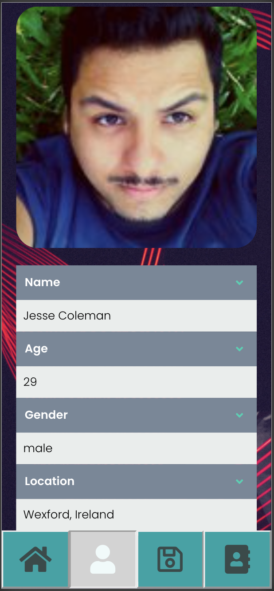
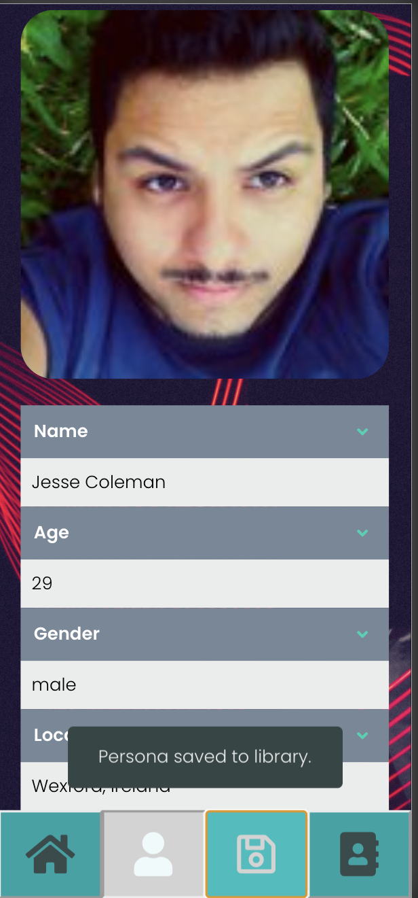

# personaGen

## Description
personaGen is an easy-to-use and customizable generator of fake user identities. Each time you ask personaGen to “generate a new persona”, it responds with the profile photo, name, age, and other personal information about a person that does not exist.

Our primary user is a developer who is working on a product that will either serve, or otherwise deal with, the data from a number of users. During their development process, our user will use personaGen to generate new and unique identities, which they can use for testing their own project.

A personaGen user can choose to generate random personae, or control custom parameters such as the age range, nationality, or profession of the persona to suit their unique project needs.

***

## Links
[GitHub Repository](https://github.com/modern-sapien/bootcamp-project-one)

[Depoloyed Site](https://modern-sapien.github.io/bootcamp-project-one/)
***

## Usage
### Home page

From the home screen, a user can either click to generate a random persona or put in custom parameters of their choice.

### Persona page

This page displays the most recently generated person OR a persona that the user has recalled from storage.

## Save button

When the user clicks the save button, a snackbar appears confirming that the person has been saved to the Library.

## Library page

A list of all saved personae. A user may click on any individual entry to bring up that persona again on the Persona page. User may a also clear entries from the library.

********************************
## Credits

### Collaborators
* Jonathan Canales [modern_sapien](https://github.com/modern-sapien)
* Jude Clark [judeclark19](https://github.com/judeclark19)
* Joseph Perry [dgtlctzn](https://github.com/dgtlctzn)

### This app accesses the following APIs:
* [randomapi.com](https://randomapi.com/)
* [Face++ Detect API](https://console.faceplusplus.com/documents/5679127)
* [Quotes](https://rapidapi.com/martin.svoboda/api/quotes15) by martin.svoboda
* [Corporate bs Generator](https://rapidapi.com/sameer.kumar/api/corporate-bs-generator) by sameer.kumar
IMDb by apidojo

### Thanks to these informational sources for helping us learn:

* w3schools [How TO - Snackbar / Toast](w3schools.com/howto/howto_js_snackbar.asp)
* w3schools [How TO - Collapse](
https://www.w3schools.com/howto/howto_js_collapsible.asp)

* [Bulma CSS Framework Crash Course](https://www.youtube.com/watch?v=IiPQYQT2-wg) by Traversy Media
***

## License

MIT License

Copyright (c) 2020 Jonathan Canales, Jude Clark, and Joseph Perry

Permission is hereby granted, free of charge, to any person obtaining a copy of this software and associated documentation files (the "Software"), to deal in the Software without restriction, including without limitation the rights to use, copy, modify, merge, publish, distribute, sublicense, and/or sell copies of the Software, and to permit persons to whom the Software is furnished to do so, subject to the following conditions:

The above copyright notice and this permission notice shall be included in all copies or substantial portions of the Software.

THE SOFTWARE IS PROVIDED "AS IS", WITHOUT WARRANTY OF ANY KIND, EXPRESS OR IMPLIED, INCLUDING BUT NOT LIMITED TO THE WARRANTIES OF MERCHANTABILITY, FITNESS FOR A PARTICULAR PURPOSE AND NONINFRINGEMENT. IN NO EVENT SHALL THE AUTHORS OR COPYRIGHT HOLDERS BE LIABLE FOR ANY CLAIM, DAMAGES OR OTHER LIABILITY, WHETHER IN AN ACTION OF CONTRACT, TORT OR OTHERWISE, ARISING FROM, OUT OF OR IN CONNECTION WITH THE SOFTWARE OR THE USE OR OTHER DEALINGS IN THE SOFTWARE.

